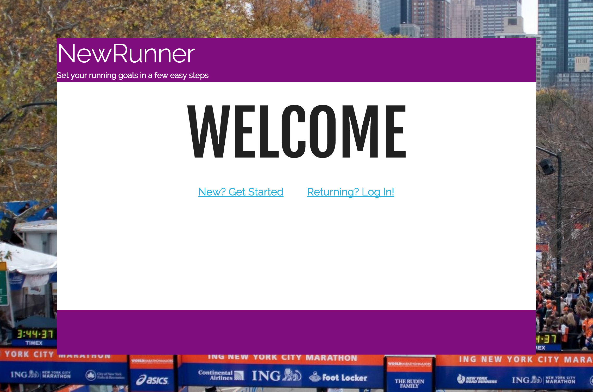
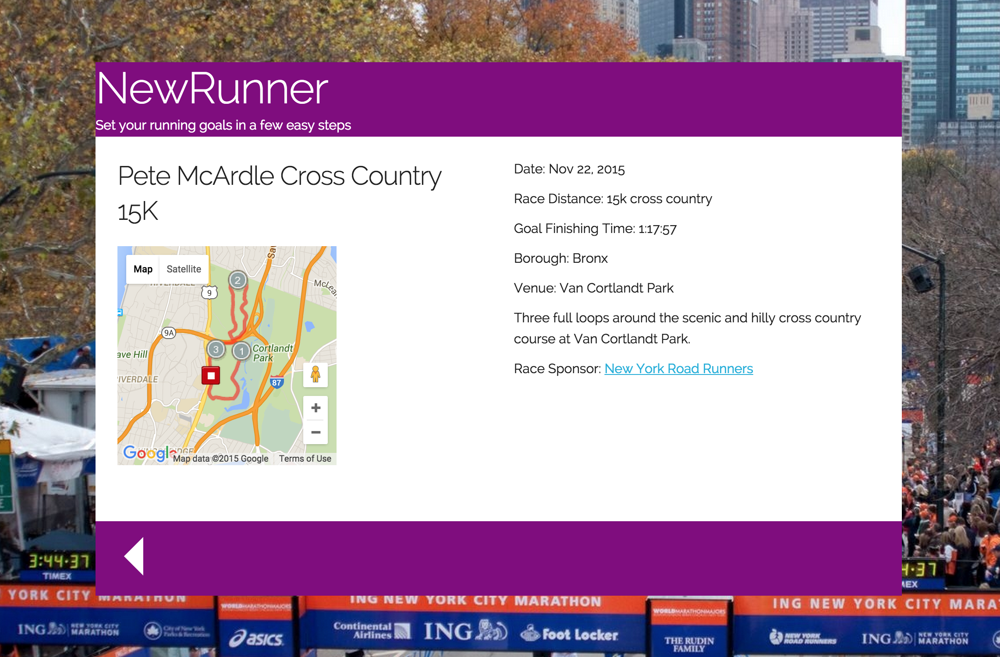

# NewRunner
### A simple fitness app for beginning runners



NewRunner is a simple single-page app to help new runners in New York City find car-free running routes and racing opportunities.  Based on the runner's inputs for comfortable mileage, pace, and workouts per week, the app suggests a training course of appropriate distance and a race to sign up for.  

NewRunner uses a custom API serving data on races and running routes in the New York City area.  Given a user's initial comfortable mileage, the app tries to choose a race from the database with a distance that should be achievable for a new runner with four to six weeks of training, assuming that the runner can increase his or her mileage per run by one mile every two weeks of training.  

### Technologies Used:

* Node.js
* MongoDB
* Express.js
* Angular.js
* JQuery
* Google Maps API

### Race Time Prediction

NewRunner provides a goal finishing time for the suggested race based on the user's best mile time (a pace of 10:00 per mile is suggested if the user does not know his or her best pace).  This calculation uses a formula developed by sports scientist Pete Riegel in the 1970s and considered to be one of the most accurate methods of predicting pace over various distances.  The version of the formula used by NewRunner is as follows:
``` a = (b * distance)^1.06 ```, where a is the predicted race finishing time and b is the user's provide mile time.  The exponent of 1.06 is the "fatigue factor", approximating the slowing of the runner's average pace over longer and longer distances due to the onset of fatigue.

NOTE:  The use of a mile pace to predict the pace of a much longer race would be of questionable use under most circumstances, as most trained runners can sprint a mile at a much faster pace than they can sustain for a long road race, probably more so than accounted for by the fatigue factor in the Riegel formula.  As NewRunner is geared towards absolute beginners, however, many of whom have never run more than a mile, this discrepancy is largely inconsequential.  Provided that the user enters an accurate mile time, NewRunner should provide a reasonably accurate projection of how fast the user could complete a 5k or 4 mile race with a few weeks of consistent training.

### API
The NewRunner API uses a MongoDB database to store data on all races currently scheduled by New York Road Runners, the largest producer of running races in the New York City area.  Races are searchable by location (borough), venue (name of park or street), and by date.

The selection of training courses provided attempts to cover a wide range of distances and terrain types as well as geographic locations.  All of the courses are as car-free as possible, meaning they use mostly dedicated running paths with as few at-grade intersections with motor vehicle traffic as possible.  Many are located close to MTA subway stations, and some have subway access at both ends allowing runners to run one way and take the train back.  The intent is to provide the user with a starter course and an introduction to a new location, with the understanding that he or she will expand the route or add multiple loops for greater distance as training progresses.

### Map Display


Each training or racing course is displayed on a map provided by the Google Maps API.  The course itself is plotted using latitude and longitude coordinates stored in KML format.  The KML files are served by the Express server from the "client" folder and and referenced by Google when the map is loaded.  KML files can be created manually or generated from a variety of sources.  For this project, MapMyRun.com was used to plot each course and export as a KML file.

### Future Development

I plan to continue to develop and update the API as new races are scheduled, and to broaden the geographic scope beyond New York City.  Future versions will allow a user to search by zip code or device geolocation to find courses and races that are close to them as well as directions to and from running locations.  Ultimately I would like to allow users to track their training progress and record their finish times as they complete races.
